# TEXT BASED RPG - MY MEDIEVAL LIFE

This project idea my medieval life was brougt to life by my desire to not only learn web development but to also learn game development, i am an avid gamer so i thought it would be a good opportunity for me to combine two passions.

My medieval life hopes that it will give a good experience with a different type of game, it also aims for people to get in contact with new ideas to help further develop the game in the future with features that others may like to see.

The intended audience for this project are as follows:

* Young adults
* Adults that like games
* Teen
* anyone that likes games set in medieval times

  
Here is the link to my [live site](https://nap199i.github.io/Text-based-RPG/).  
Here's the [am i responsive](https://ui.dev/amiresponsive?url=https://nap199i.github.io/Text-based-RPG) site for my project.

## UX

My UX process was again to go through a microsoft document that I have made previously, it takes me through the five planes of UX. I also had to really think about what would be important to me as the owner, operator, developer and as a user, my goal for the site was to decide who i would want to use it, what the purpose of the site was, the color schemes, what i wanted for the initial release and things that I may want to add in later releases.

### Colour Scheme

The idea behind the color scheme used was wanting to use red, green and white the colors on the welsh flag however I had to use some other colors also for text and social icons to make the scheme work.

- `#000000` used for primary text and content titles.
- `#ed1d23` used for nav and footer backgrounds and inside social icons.
- `#219b54` used for the background color of the buttons.
- `#66c08b` used for the hover effect color of the buttons.
- `#C39678` used for the background container circle of the social icons.
- `#c4b0a3` used for the hover effect on the background container circle of the social icons.

I used [coolors.co](https://coolors.co/000000-ed1d23-219b54-66c08b-c39678-c4b0a3) to generate my colour palette.

### Typography

The reason i picked these fonts again was because I believe they give a professional and clean look to the site once used.

- [Libre Baskerville](https://fonts.google.com/specimen/Libre+Baskerville?query=libre) was used for the main titles on each page and game titles.

- [Roboto](https://fonts.google.com/specimen/Roboto?query=robo) was used for the sub heading on the main page.

- [Montserrat](https://fonts.google.com/specimen/Montserrat) was used for the primary text throughout the site.

- [Font Awesome](https://fontawesome.com) icons were used throughout the site, such as the social media icons in the footer.

## User Stories

To help with this section, what I planned for the site admin goals and different user goals have been shown below.

### New Site Users

- As a new site user, I would like to know what the site is, so that I can make a decision on whether i want to continue to engage with the site.
- As a new site user, I would like to know what i can do on the site, so that I can go and do it.
- As a new site user, I would like to contact the administration, so that I can ask any questions I may have, report any bugs or give any ideas to help improve the site.
- As a new site user, I would like to find out how to play, so that I can play the game.

### Returning Site Users

- As a returning site user, I would like to find the game, so that I can play a different story line.
- As a returning site user, I would like to contact the administration, so that I can ask any questions I may have, report any bugs or give any ideas to help improve the site.

### Site Admin

- As a site administrator, I should be able to access the page code, so that I can update and add new content.
- As a site administrator, I should be able to recieve and answer queries by email, so that I can assist anyone with any questions or ideas.

## Mockups

I've used [Affinity 2](https://affinity.serif.com/en-gb/) to design my site Mockups, I own the software but the link will take you to their site.

### Home Page Mockups

| Size | Screenshot |
| --- | --- |
| Mobile |  |
| Desktop |  |

### How To Play Mockups

| Size | Screenshot |
| --- | --- |
| Mobile | 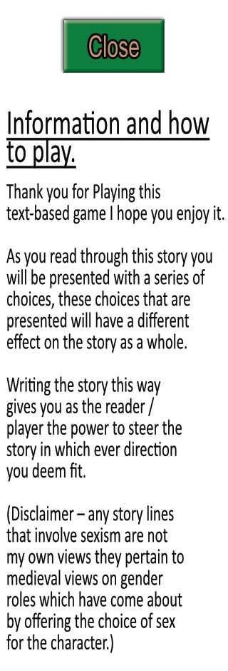 |
| Desktop |  |

### Game Screen Mockups

| Size | Screenshot |
| --- | --- |
| Mobile |  |
| Desktop |  |

### Contact Page Mockups

| Size | Screenshot |
| --- | --- |
| Mobile |  |
| Desktop |  |

## Features

The website consists of the following pages:  
* Home page
* How to play - part of the home page
* Game page
* contact page 
* confirmation page 

There will be a breakdown of each pages features in order below

### Existing Features

- **Feature #1 - Nav bar**

    - The nav bar is a helpful navigation feature displayed clearly at the top of each page to give the user easy navigation controls for the site, this benefits the site because it makes all areas easily accessible, the nav bar items also change their position as the screen gets smaller and finally when you hover over an element of the nav bar it gives the user clear feedback as seen in the screenshots below.

Nav bar large screen

Nav bar with how to play hovered over

Small screen nav bar

- **Feature #2 hero image, title and start button on home page**

    - Here we have a nice hero image displaying a medieval castle whith a clear concise title making sure the user knows where they are and what the site is about, there is also a large start button ensuring users know how to start the game therefore benefiting the users experience and the sites usability.

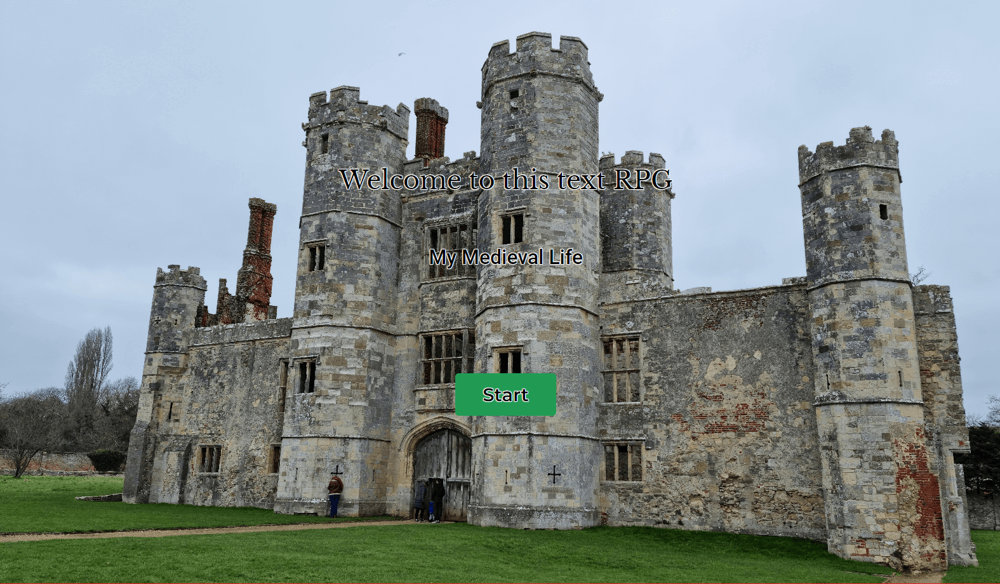

- **Feature #3 footer icons**

    - The footer icons are part of the footer which lets the user know that they have come to the end of the page, the icons themselfs are links to social medias for if they wish to connect in other ways with the site, once the icons have been hovered over they give a feedback to let the user know that they are hovering and the site is registering their movements giving them feedback for a good user experience which also benefits the sites usability and credability.

This is the regular footer with the social icons displayed:  

  

This is the footer with the hover effect applied so you can see the feedback the user would get when they hover, the effect is applied to the facebook icon on the left:  

- **Feature #4 how to play**

    - The how to play section is not its own page this is an off canvas box that enters and exits the screen on the left hand side, on mobile it covers the entire screen.
    This has been kept to plain black text on a white background for ease of readability and to be kept simple so as not to overwhelm any user.
    The how to play has a close button with the normal fearutes as the others as outlined in the above features, this is the only aspect that has not been kept to black and white.

This is the how to play window once opened:  

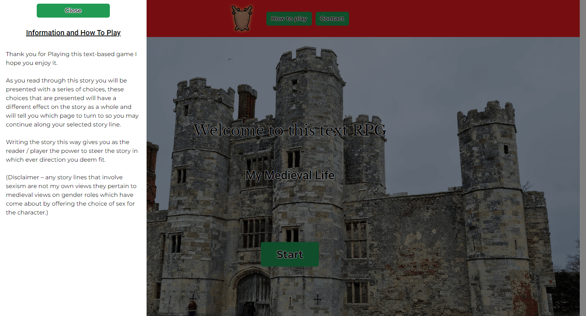

- **Feature #5 contact form**

    - On the contact form we have the contact header as a call to action, I have set the name, email and message to required so we know who is getting in contact, a way to contact them back to answer the query and the message so there is something to answer. Finally I set the submit button to give feedback on hover as all the others on the site, I also set the submit button to disable once the message has been successfully sent as it takes a couple of seconds for the site to process the api request and act accordingly, this all benefits the user so they dont accidentally send the query unfinished and so they know the site is registering their movements for a good user experience, it benefits the site so there is not incomplete messages sent.  

The full contact form:  

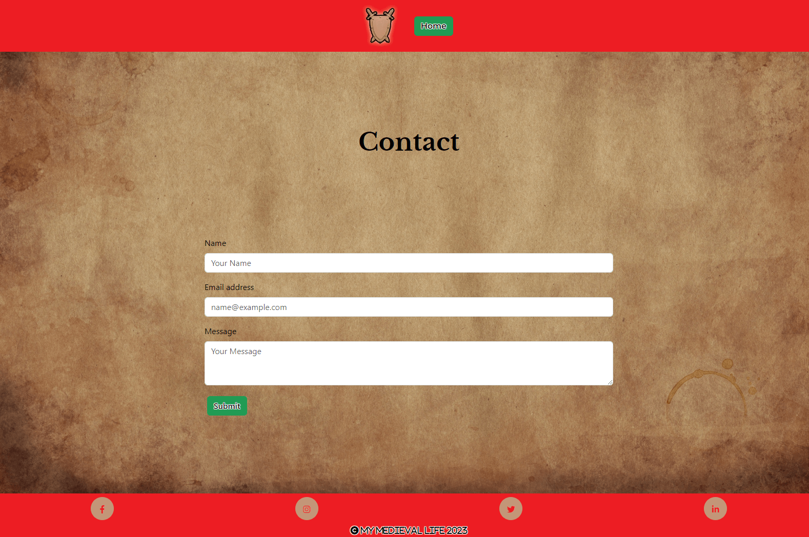

The name required showing:  

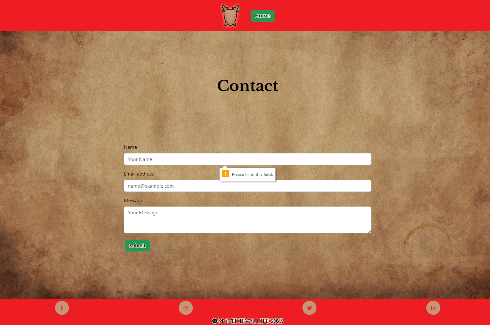

The email required showing:  

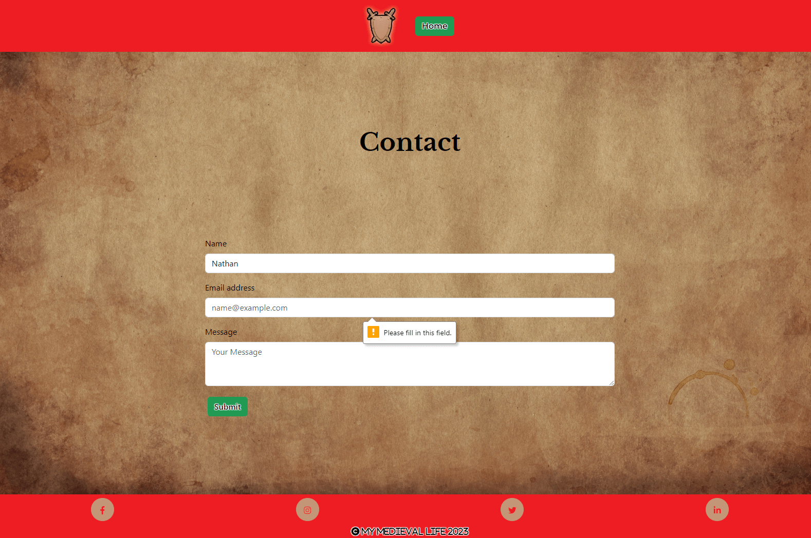

The message required showing:  

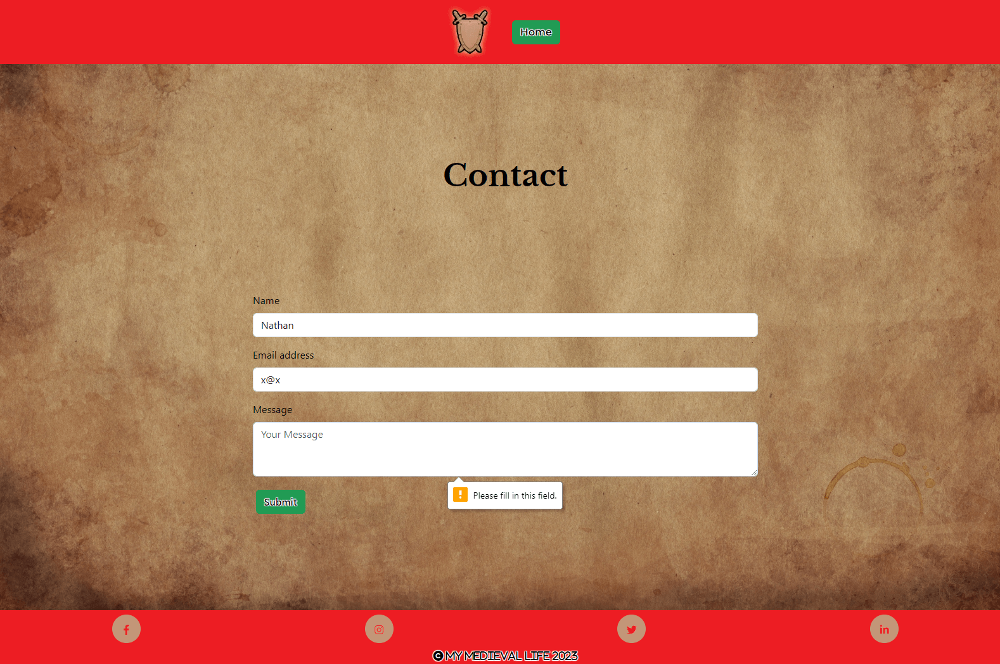

The submit button disabled:  

- **Feature #6 confirmation**

    - The confirmation of submission page is a nice feature for a good user experience, letting the user know that the submission has been successful, how long is needed before they get a response and helping them get back to the main site automatically or through a link.

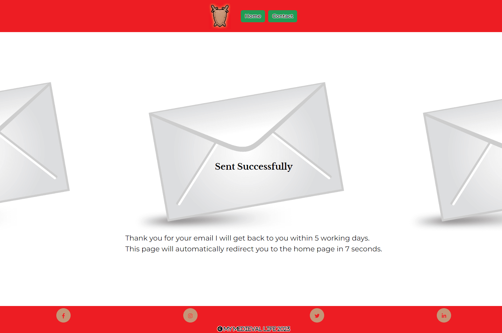  

- **Feature #7 confirmation automatic redirect**

    - The automatic redirect is a good feature for user experience again due to the message being displayed and the user not having to do anything to get back to the main site.

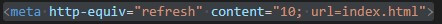

- **Feature #8 automatic ten second countdown**

    - The automatic countdown is a good feature for user experience again due to the message being displayed and the user being able to see how long there is until their redirect so they can see that the function is working, to see this in action for yourself I have included a link to the [confirmation-page](https://nap199i.github.io/Text-based-RPG/confirmation.html).

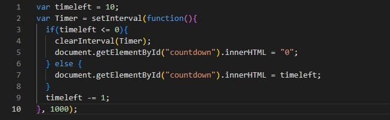

- **Feature #9 The game**

    - The game has a different title for every selection which has to do with the path the user has taken, this reinforces the choice they made helping for a good user experience, the main text is black text on a white background to help readability and the buttons for the choices give the same feedback as every other button on the site as featured above.

screenshot of two different titles:

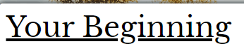

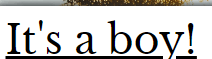

Screenshot of the black text on white background:
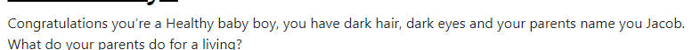

Screenshot of the game buttons:

### Future Features

For future features I do have a couple if ideas that I will list below, these havent been implemented yet for a few reasons, these being:  
* viability
* lack of knowledge / skill
* keeping the site simple for release

- feature #1 a login specific for each user so a sign up / in page
    - If I can implement a login the game could then have a list of members which ties into another future feature, this was not implemented due to my lack of skill and knowledge in this area. 

- feature #2 a function for the game to remember each users specific progress
    - If I can implement this feature I think I would need a login so the site could recall specific user progress, this was not implemented due to my lack of skill and knowledge in this area. 

- feature #3 expand the game from just a story to having items shops fights, life bars and experience bars.
    - Once I have finished off each story path to the end I would like to implement other features like buying and selling items to shops, a life bar for fights and an experience bar for players leveling up their character, this was not implemented due to my lack of skill and knowledge in this area. 

## Tools & Technologies Used

⚠️⚠️⚠️⚠️⚠️ START OF NOTES (to be deleted) ⚠️⚠️⚠️⚠️⚠️

In this section, you should explain the various tools and technologies used to develop the project.
Make sure to put a link (where applicable) to the source, and explain what each was used for.
Some examples have been provided, but this is just a sample only, your project might've used others.
Feel free to delete any unused items below as necessary.

🛑🛑🛑🛑🛑 END OF NOTES (to be deleted) 🛑🛑🛑🛑🛑

- [HTML](https://en.wikipedia.org/wiki/HTML) used for the main site content.
- [CSS](https://en.wikipedia.org/wiki/CSS) used for the main site design and layout.
- [CSS :root variables](https://www.w3schools.com/css/css3_variables.asp) used for reusable styles throughout the site.
- [CSS Flexbox](https://www.w3schools.com/css/css3_flexbox.asp) used for an enhanced responsive layout.
- [CSS Grid](https://www.w3schools.com/css/css_grid.asp) used for an enhanced responsive layout.
- [JavaScript](https://www.javascript.com) used for user interaction on the site.
- [Python](https://www.python.org) used as the back-end programming language.
- [Git](https://git-scm.com) used for version control. (`git add`, `git commit`, `git push`)
- [GitHub](https://github.com) used for secure online code storage.
- [GitHub Pages](https://pages.github.com) used for hosting the deployed front-end site.
- [Gitpod](https://gitpod.io) used as a cloud-based IDE for development.
- [Bootstrap](https://getbootstrap.com) used as the front-end CSS framework for modern responsiveness and pre-built components.
- [Materialize](https://materializecss.com) used as the front-end CSS framework for modern responsiveness and pre-built components.
- [Flask](https://flask.palletsprojects.com) used as the Python framework for the site.
- [Django](https://www.djangoproject.com) used as the Python framework for the site.
- [MongoDB](https://www.mongodb.com) used as the non-relational database management with Flask.
- [SQLAlchemy](https://www.sqlalchemy.org) used as the relational database management with Flask.
- [PostgreSQL](https://www.postgresql.org) used as the relational database management.
- [ElephantSQL](https://www.elephantsql.com) used as the Postgres database.
- [Heroku](https://www.heroku.com) used for hosting the deployed back-end site.
- [Cloudinary](https://cloudinary.com) used for online static file storage.
- [Stripe](https://stripe.com) used for online secure payments of ecommerce products/services.
- [AWS S3](https://aws.amazon.com/s3) used for online static file storage.

## Testing

For all testing, please refer to the [TESTING.md](TESTING.md) file.

## Deployment

The site was deployed to GitHub Pages. The steps to deploy are as follows:
- In the [GitHub repository](https://github.com/Nap199I/Text-based-RPG), navigate to the Settings tab 
- From the source section drop-down menu, select the **Main** Branch, then click "Save".
- The page will be automatically refreshed with a detailed ribbon display to indicate the successful deployment.

The live link can be found [here](https://nap199i.github.io/Text-based-RPG)

### Local Deployment

This project can be cloned or forked in order to make a local copy on your own system.

#### Cloning

You can clone the repository by following these steps:

1. Go to the [GitHub repository](https://github.com/Nap199I/Text-based-RPG) 
2. Locate the Code button above the list of files and click it 
3. Select if you prefer to clone using HTTPS, SSH, or GitHub CLI and click the copy button to copy the URL to your clipboard
4. Open Git Bash or Terminal
5. Change the current working directory to the one where you want the cloned directory
6. In your IDE Terminal, type the following command to clone my repository:
	- `git clone https://github.com/Nap199I/Text-based-RPG.git`
7. Press Enter to create your local clone.

Alternatively, if using Gitpod, you can click below to create your own workspace using this repository.

Please note that in order to directly open the project in Gitpod, you need to have the browser extension installed.
A tutorial on how to do that can be found [here](https://www.gitpod.io/docs/configure/user-settings/browser-extension).

#### Forking

By forking the GitHub Repository, we make a copy of the original repository on our GitHub account to view and/or make changes without affecting the original owner's repository.
You can fork this repository by using the following steps:

1. Log in to GitHub and locate the [GitHub Repository](https://github.com/Nap199I/Text-based-RPG)
2. At the top of the Repository (not top of page) just above the "Settings" Button on the menu, locate the "Fork" Button.
3. Once clicked, you should now have a copy of the original repository in your own GitHub account!

### Local VS Deployment

⚠️⚠️⚠️⚠️⚠️ START OF NOTES (to be deleted) ⚠️⚠️⚠️⚠️⚠️

Use this space to discuss any differences between the local version you've developed, and the live deployment site on GitHub Pages.

🛑🛑🛑🛑🛑 END OF NOTES (to be deleted) 🛑🛑🛑🛑🛑

## Credits

⚠️⚠️⚠️⚠️⚠️ START OF NOTES (to be deleted) ⚠️⚠️⚠️⚠️⚠️

In this section you need to reference where you got your content, media, and extra help from.
It is common practice to use code from other repositories and tutorials,
however, it is important to be very specific about these sources to avoid plagiarism.

🛑🛑🛑🛑🛑 END OF NOTES (to be deleted) 🛑🛑🛑🛑🛑

### Content

⚠️⚠️⚠️⚠️⚠️ START OF NOTES (to be deleted) ⚠️⚠️⚠️⚠️⚠️

Use this space to provide attribution links to any borrowed code snippets, elements, or resources.
A few examples have been provided below to give you some ideas.

Ideally, you should provide an actual link to every resource used, not just a generic link to the main site!

🛑🛑🛑🛑🛑 END OF NOTES (to be deleted) 🛑🛑🛑🛑🛑

| Source | Location | Notes |
| --- | --- | --- |
| [Markdown Builder](https://traveltimn.github.io/markdown-builder) | README and TESTING | tool to help generate the Markdown files |
| [Chris Beams](https://chris.beams.io/posts/git-commit) | version control | "How to Write a Git Commit Message" |
| [W3Schools](https://www.w3schools.com/howto/howto_js_topnav_responsive.asp) | entire site | responsive HTML/CSS/JS navbar |
| [W3Schools](https://www.w3schools.com/howto/howto_css_modals.asp) | contact page | interactive pop-up (modal) |
| [W3Schools](https://www.w3schools.com/css/css3_variables.asp) | entire site | how to use CSS :root variables |
| [Flexbox Froggy](https://flexboxfroggy.com/) | entire site | modern responsive layouts |
| [Grid Garden](https://cssgridgarden.com) | entire site | modern responsive layouts |
| [StackOverflow](https://stackoverflow.com/a/2450976) | quiz page | Fisher-Yates/Knuth shuffle in JS |
| [YouTube](https://www.youtube.com/watch?v=YL1F4dCUlLc) | leaderboard | using `localStorage()` in JS for high scores |
| [YouTube](https://www.youtube.com/watch?v=u51Zjlnui4Y) | PP3 terminal | tutorial for adding color to the Python terminal |
| [strftime](https://strftime.org) | CRUD functionality | helpful tool to format date/time from string |
| [WhiteNoise](http://whitenoise.evans.io) | entire site | hosting static files on Heroku temporarily |

### Media

⚠️⚠️⚠️⚠️⚠️ START OF NOTES (to be deleted) ⚠️⚠️⚠️⚠️⚠️

Use this space to provide attribution links to any images, videos, or audio files borrowed from online.
A few examples have been provided below to give you some ideas.

If you're the owner (or a close acquaintance) of all media files, then make sure to specify this.
Let the assessors know that you have explicit rights to use the media files within your project.

Ideally, you should provide an actual link to every media file used, not just a generic link to the main site!
The list below is by no means exhaustive. Within the Code Institute Slack community, you can find more "free media" links
by sending yourself the following command: `!freemedia`.

🛑🛑🛑🛑🛑 END OF NOTES (to be deleted) 🛑🛑🛑🛑🛑

| Source | Location | Type | Notes |
| --- | --- | --- | --- |
| [Pexels](https://www.pexels.com) | entire site | image | favicon on all pages |
| [Lorem Picsum](https://picsum.photos) | home page | image | hero image background |
| [Unsplash](https://unsplash.com) | product page | image | sample of fake products |
| [Pixabay](https://pixabay.com) | gallery page | image | group of photos for gallery |
| [Wallhere](https://wallhere.com) | footer | image | background wallpaper image in the footer |
| [This Person Does Not Exist](https://thispersondoesnotexist.com) | testimonials | image | headshots of fake testimonial images |
| [Audio Micro](https://www.audiomicro.com/free-sound-effects) | game page | audio | free audio files to generate the game sounds |
| [Videvo](https://www.videvo.net/) | home page | video | background video on the hero section |
| [TinyPNG](https://tinypng.com) | entire site | image | tool for image compression |

### Acknowledgements

⚠️⚠️⚠️⚠️⚠️ START OF NOTES (to be deleted) ⚠️⚠️⚠️⚠️⚠️

Use this space to provide attribution to any supports that helped, encouraged, or supported you throughout the development stages of this project.
A few examples have been provided below to give you some ideas.

🛑🛑🛑🛑🛑 END OF NOTES (to be deleted) 🛑🛑🛑🛑🛑

- I would like to thank my Code Institute mentor, [Tim Nelson](https://github.com/TravelTimN) for their support throughout the development of this project.
- I would like to thank the [Code Institute](https://codeinstitute.net) tutor team for their assistance with troubleshooting and debugging some project issues.
- I would like to thank the [Code Institute Slack community](https://code-institute-room.slack.com) for the moral support; it kept me going during periods of self doubt and imposter syndrome.
- I would like to thank my partner (John/Jane), for believing in me, and allowing me to make this transition into software development.
- I would like to thank my employer, for supporting me in my career development change towards becoming a software developer.
