# Testing

Return back to the [README.md](README.md) file.

In this section I will be showing that I have conducted enough testing to legitimately believe that the site works well.
Essentially, in this part, I will be going over all of my project's features to ensure that they all work as intended,
with the project providing an easy and straightforward way for the users to achieve their goals.

## Code Validation

I will use this space to discuss code validation for all of my own code files (where applicable).
I will not validate external libraries/frameworks, such as imported Bootstrap, Font Awesome, etc.

### HTML

I have used the recommended [HTML W3C Validator](https://validator.w3.org) to validate all of my HTML files.

I validated the live pages (each of them) using the deployed URL.
This will give me a custom URL as well, which I will use on my testing documentation.
It makes it easier to return back to a page to validate it again in the future.

| Page | W3C URL | Screenshot | Notes |
| --- | --- | --- | --- |
| Home | [W3C](https://validator.w3.org/nu/?doc=https%3A%2F%2Fnap199i.github.io%2FText-based-RPG%2F) | 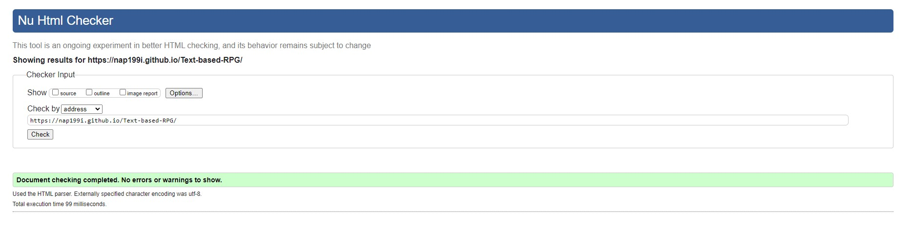 | Pass: No Errors |
| Contact | [W3C](https://validator.w3.org/nu/?doc=https%3A%2F%2Fnap199i.github.io%2FText-based-RPG%2Fcontact.html) | 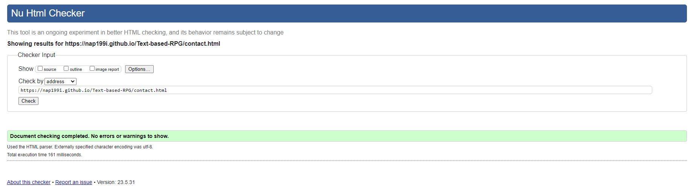 | Pass: No Errors |
| Game | [W3C](https://validator.w3.org/nu/?doc=https%3A%2F%2Fnap199i.github.io%2FText-based-RPG%2Fgame.html) | 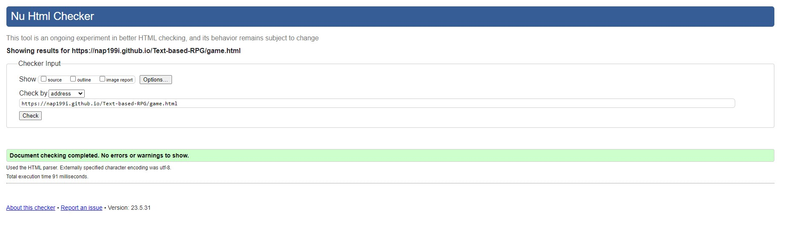 | Pass: No Errors |
| confirmation | [W3C](https://validator.w3.org/nu/?doc=https%3A%2F%2Fnap199i.github.io%2FText-based-RPG%2Fconfirmation.html) | 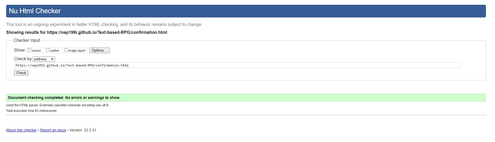 | Pass: No Errors |

### CSS

I have used the recommended [CSS Jigsaw Validator](https://jigsaw.w3.org/css-validator) to validate my CSS files.

CSS code validation documentation:

| File | Jigsaw URL | Screenshot | Notes |
| --- | --- | --- | --- |
| style.css | [Jigsaw](https://jigsaw.w3.org/css-validator/validator?uri=https%3A%2F%2Fnap199i.github.io%2FText-based-RPG%2F&profile=css3svg&usermedium=all&warning=1&vextwarning=&lang=en#css) | 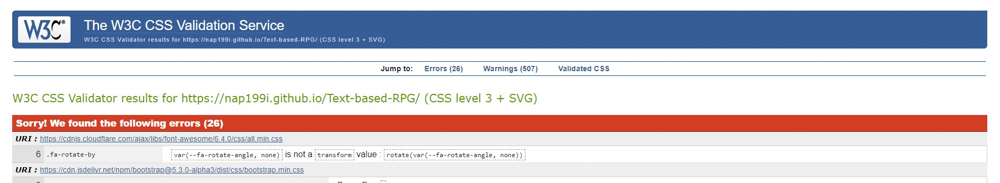 | Pass on personal code: No Errors, the shown errors are from the font awesome and bootstrap library as seen in the screenshot and the warnings are from the imported bootstrap and font awesome files. |

### JavaScript

I have used the recommended [JShint Validator](https://jshint.com) to validate all of my JS files.

JavaScript code validation documentation:

| File | Screenshot | Notes |
| --- | --- | --- |
| countdown.js | 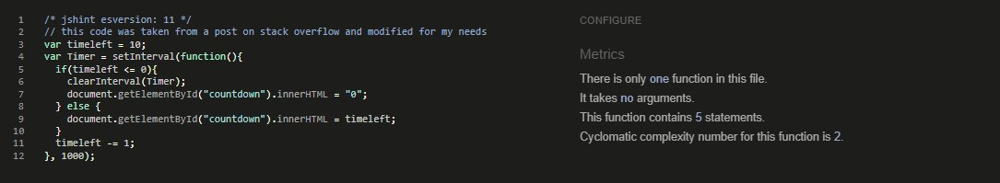 | Pass: No Errors |
| data.js | 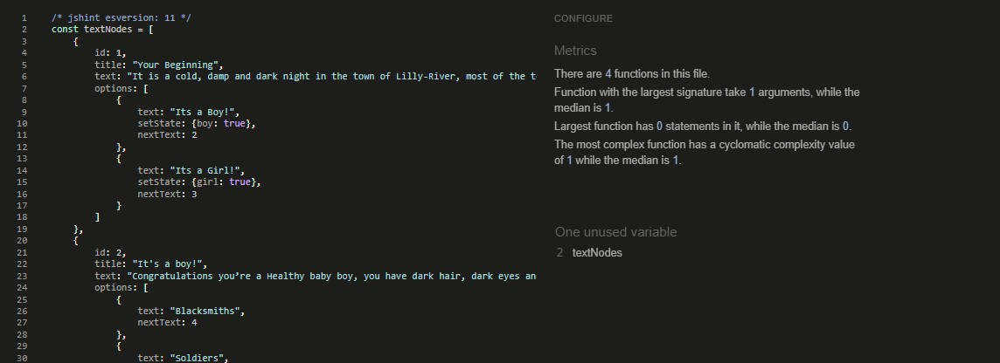 | Unused variable from external game.js file |
| game.js | 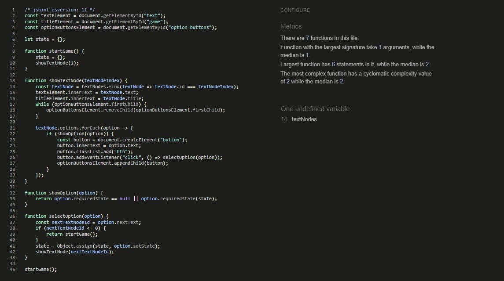 |  Unused variable from external data.js file |
| sendEmail.js | 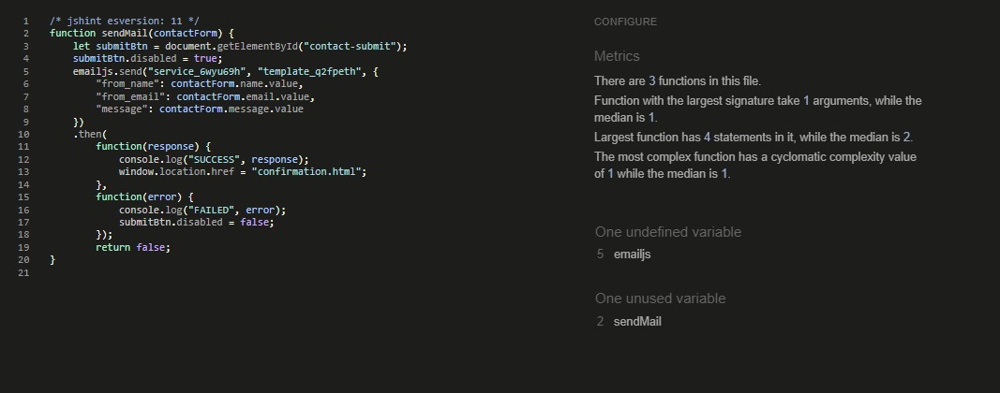 | Unused and undefined variable from external file |

## Browser Compatibility

This space will be used to discuss testing of the live/deployed site on various browsers.

Browser testing documentation:

I've tested my deployed project on multiple browsers to check for compatibility issues.

| Browser | Screenshot | Notes |
| --- | --- | --- |
| Chrome | 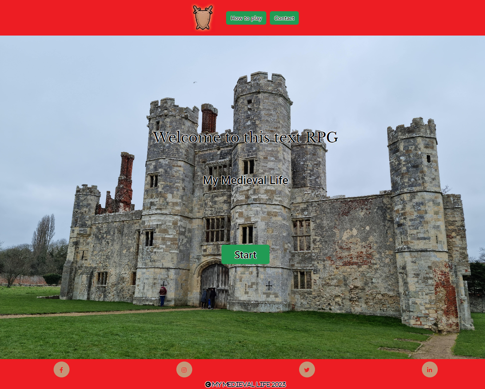 | Works as expected |
| Edge | 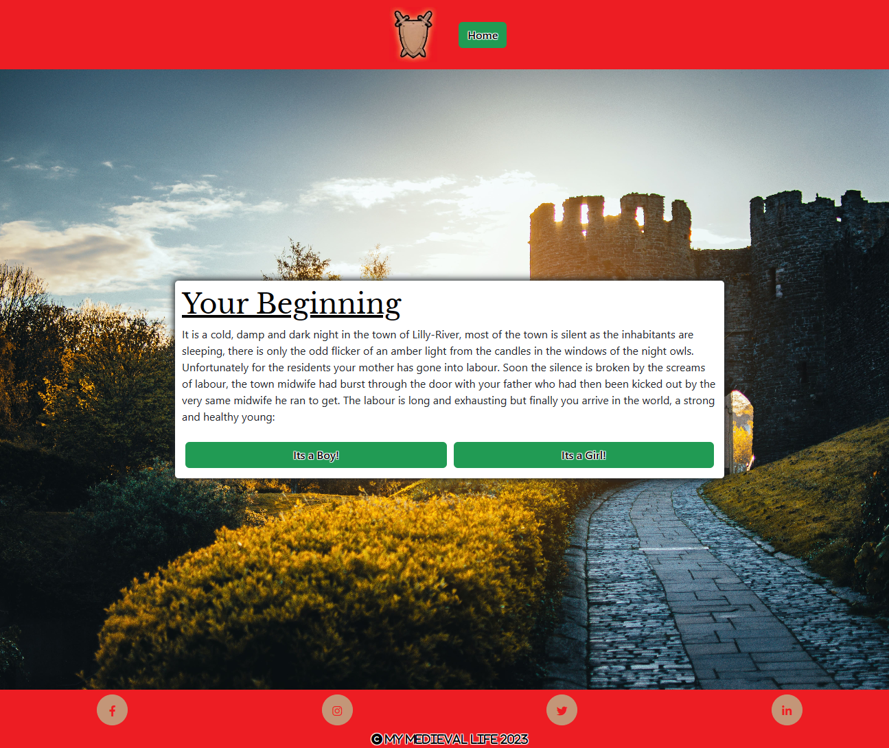 | Works as expected |
| Brave |  | Works as expected |
| Opera | 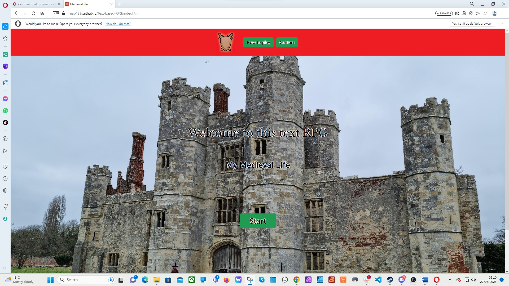 | Works as expected |

## Responsiveness

Here i will discuss testing the live/deployed site on various device sizes and screen sizes.

Responsiveness testing documentation:

I've tested my deployed project on devices and DevTools screen sizes to check for responsiveness issues.

| Device | Screenshot | Notes |
| --- | --- | --- |
| Mobile small (DevTools) | 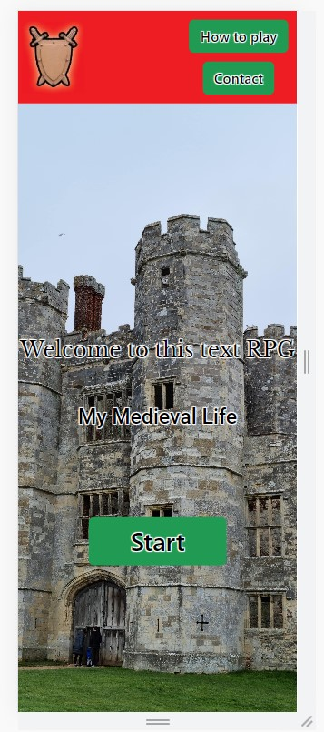 | Works as expected |
| Mobile medium (DevTools) | 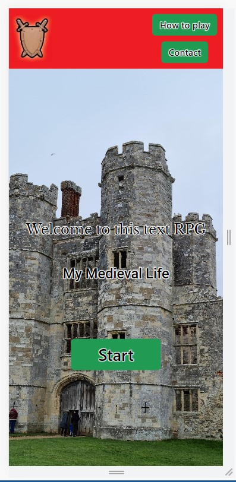 | Works as expected |
| Mobile large (DevTools) | 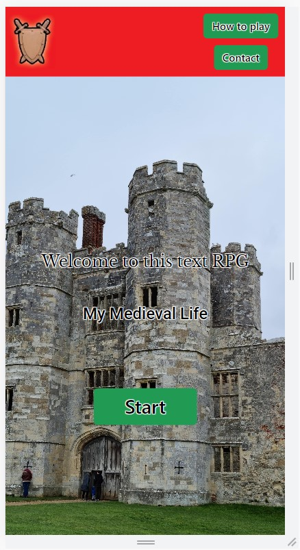 | Works as expected |
| Tablet (DevTools) | 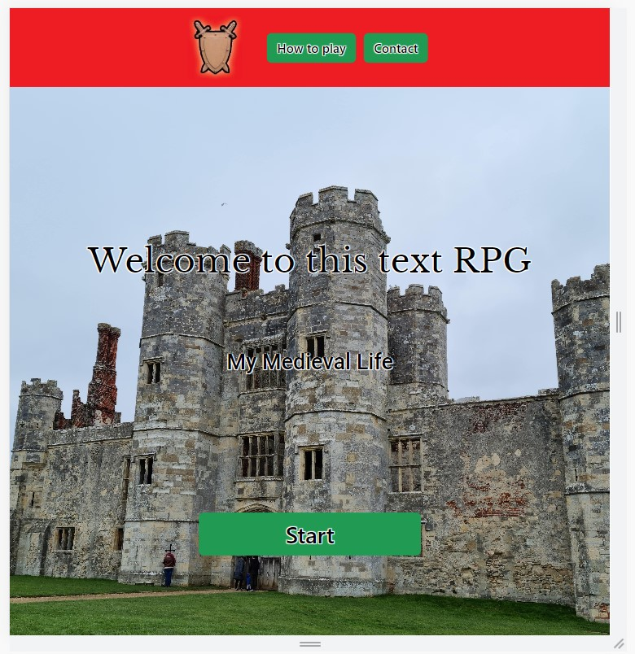 | Works as expected |
| laptop (DevTools) | 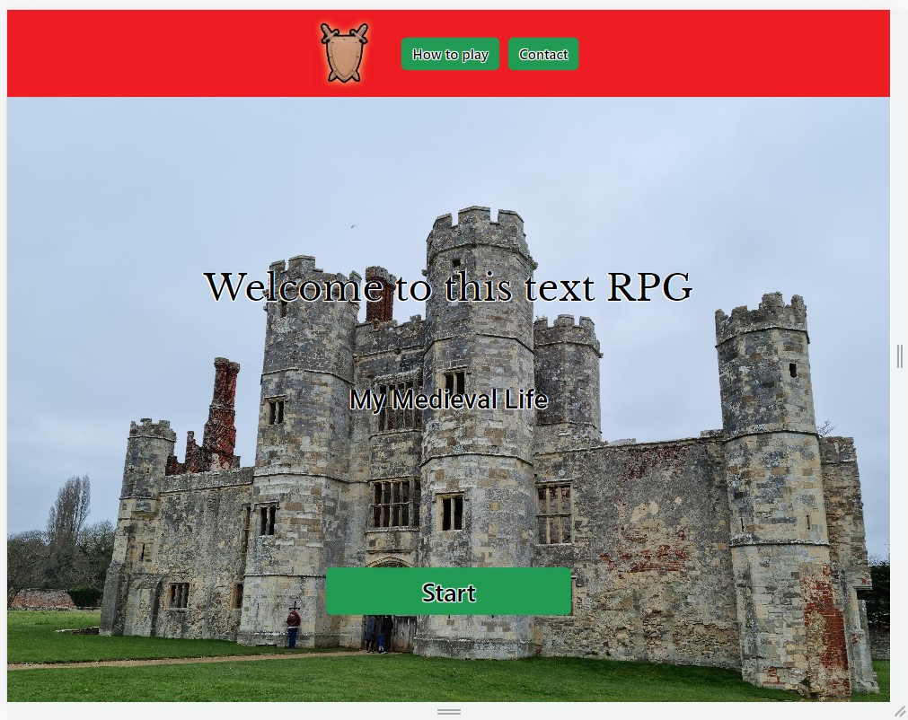 | Works as expected |
| laptop large (DevTools) | 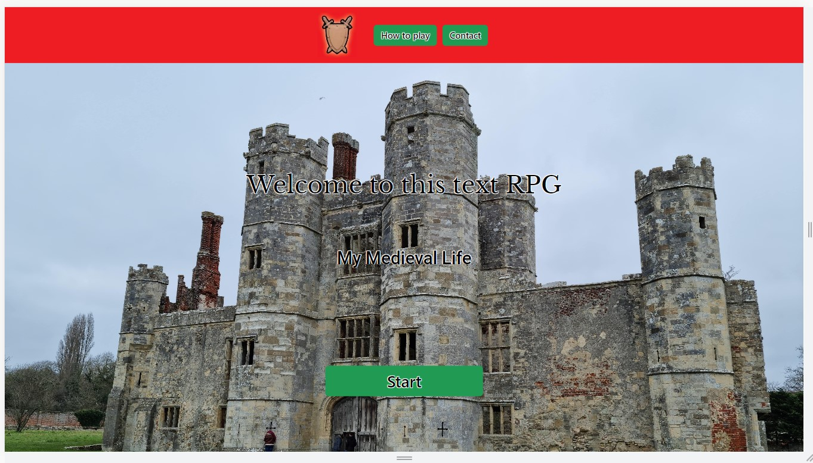 | Works as expected |
| Desktop | 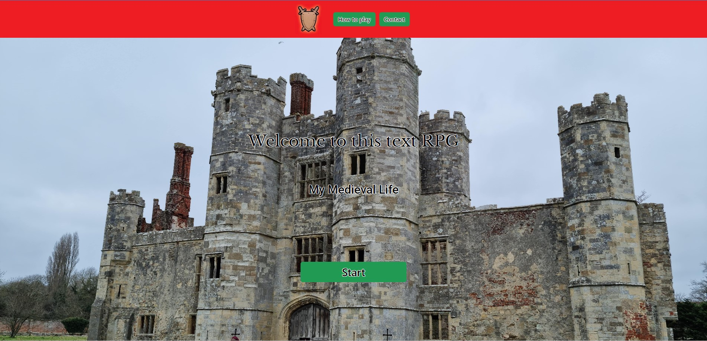 | Works as expected |
| 4K Monitor (DevTools) | 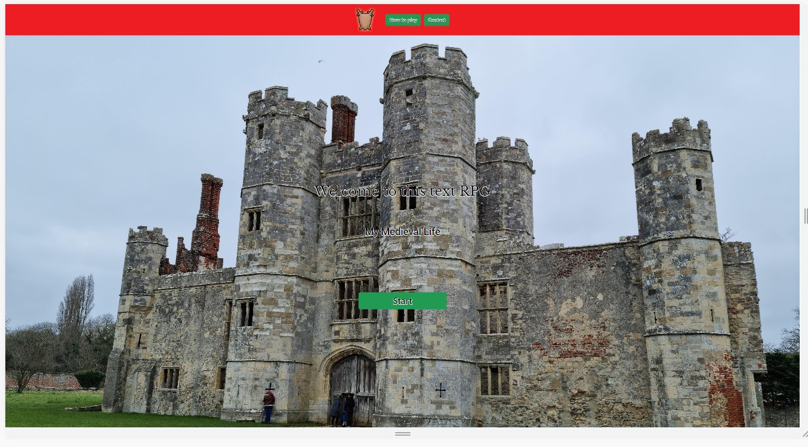 | Works as expected |

## Lighthouse Audit

Here i will discuss testing the live/deployed site's Lighthouse Audit reports.

Lighthouse testing documentation:

I've tested my deployed project using the Lighthouse Audit tool for all of my pages to check for any major issues.

| Page | Size | Screenshot | Notes |
| --- | --- | --- | --- |
| Home | Mobile | 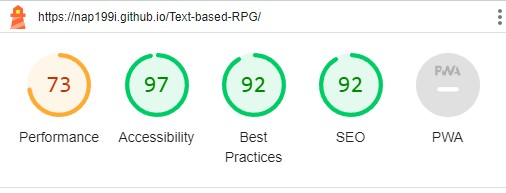 | Some warnings due to large images |
| Home | Desktop | 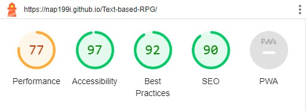 | Some warnings due to large images |
| contact | Mobile | 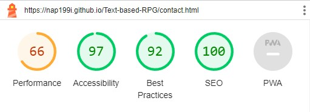 | Some warnings due to large images |
| contact | Desktop | 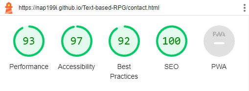 | Few warnings |
| game | Mobile | 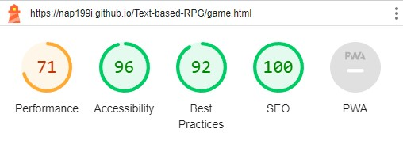 | Some warnings due to large images |
| game | Desktop | 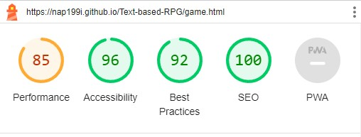 | Some warnings due to large images |
| confirmation | Mobile | 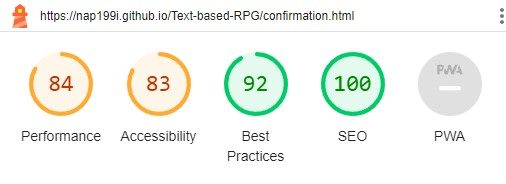 | Some minor warnings |
| confirmation | Desktop | 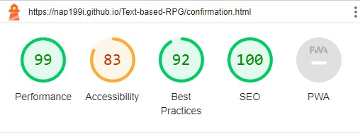 | Some minor warnings |

## Defensive Programming

I will be using this section to discuss what devensive programming was used within this project.

Defensive programming was manually tested with the below user acceptance testing:

| Page | User Action | Expected Result | Pass/Fail | Comments |
| --- | --- | --- | --- | --- |
| Home Page | | | | |
| | Click on Logo | Redirection to Home page | Pass | |
| | Click on Home link in navbar | Redirection to Home page | Pass | |
| | Click on Start to be taken to game page | Redirection to game page | Pass | |
| game page | | | | |
| | Click on Logo | Redirection to Home page | Pass | |
| | Click on Home link in navbar | Redirection to Home page | Pass | |
| confirmation page | | | | |
| | Click on Logo | Redirection to Home page | Pass | |
| | Automatic redirect | Redirection to Home page | Pass | |
| | Countdown timer | From ten to zero | Pass | |
| | Click on Home link in navbar | Redirection to Home page | Pass | |
| Contact Page | | | | |
| | Click on Contact link in navbar | Redirection to Contact page | Pass | |
| | Enter first/last name | Field will accept freeform text | Pass | |
| | Enter valid email address | Field will only accept email address format | Pass | |
| | Enter message in textarea | Field will accept freeform text | Pass | |
| | Click the Submit button | Redirects user to confirmation page | Pass | |

## User Story Testing

| User Story | Screenshot |
| --- | --- |
| As a new site user, I would like to know what the site is, so that I can make a decision on whether i want to continue to engage with the site. |  |
| As a new site user, I would like to know what I can do on the site, so that I can go and do it. |   |
| As a new site user, I would like to contact the administration, so that I can ask any questions I may have, report any bugs or give any ideas to help improve the site. | 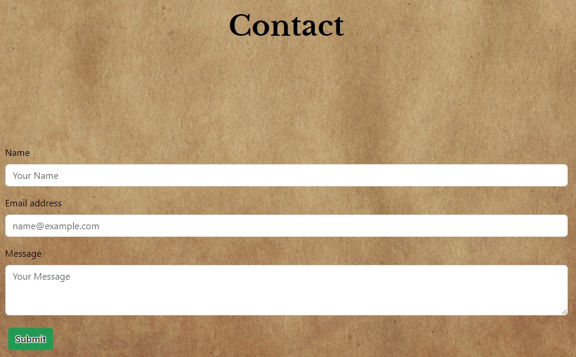 |
| As a new site user, I would like to find out how to play, so that I can play the game. |  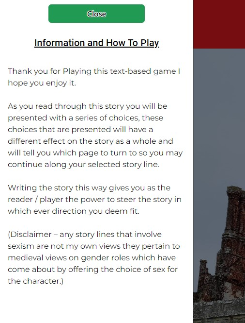 |
| As a returning site user, I would like to find the game, so that I can play a different story line. |  |
| As a returning site user, I would like to contact the administration, so that I can ask any questions I may have, report any bugs or give any ideas to help improve the site. |  |
| As a site administrator, I should be able to access the page code, so that I can update and add new content. | 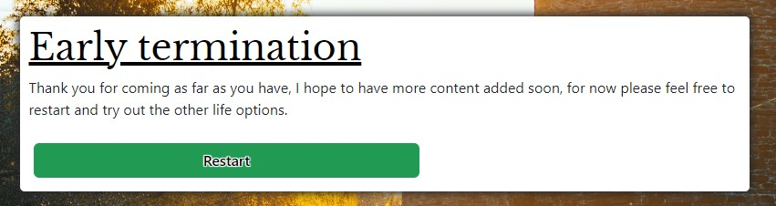 |
| As a site administrator, I should be able to recieve and answer queries by email, so that I can assist anyone with any questions or ideas. |  |

## Automated Testing

I have conducted a series of automated tests on my application.

I fully acknowledge and understand that, in a real-world scenario, an extensive set of additional tests would be more comprehensive.

### JavaScript (Jest Testing)

I have used the [Jest](https://jestjs.io) JavaScript testing framework to test the application functionality.

In order to work with Jest, I first had to initialize NPM.

Below are the results from the tests that I've written for this application:

| Test Suites | Tests | Screenshot |
| --- | --- | --- |
| 1 failed | 1 passed | 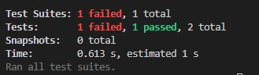 |

#### Jest Test Issues

I have currently not been able to advance the countdown timer on confirmation.html to get the test to pass.

## Bugs

The first bug was a fav icon error that was showing as I had not set a fav icon for my pages:  
I fixed this bug by adding the code `<link rel="shortcut icon" href="assets/images/logo-snip-min.jpg" type="image/x-icon">` to the head element of each page which gave my page's a fav icon and fixed the error.  
  
The second bug was once I had gotten the nav and footer how I wanted it I checked the contrast in the dev tools to make sure it was ok, it was not so I fixed this by changing the text colour to black and making the buttons in the nav bar a lighter shade of green  

The third bug I came across was an issue getting a button to automatically disable on the contact form after being clicked, I was writing the js outside the function when it needed to be inside this was fixed with the help of tim my mentor. 

The fourth bug was within the game.js file the function to remove and replace the buttons was not working, the issue was on line 2 of the game.js file I had the wrong id, I had written option-button instead of option-buttons

finally on the game page there was a part where the story and buttons go so large on mobile that it pushed above the nav bar and below the footer making you unable to read the text and showing white page below the footer, I fixed this by adding the max-height property to the game container on my style sheet.

**Open Issues**

There are no open issues in my github.

## Unfixed Bugs

There are no remaining bugs that I am aware of.
